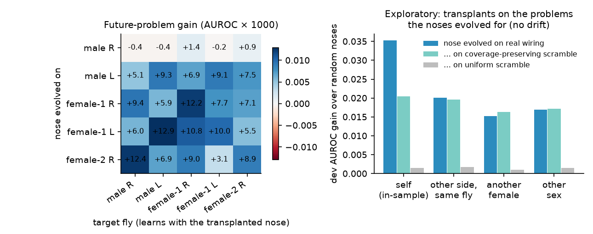
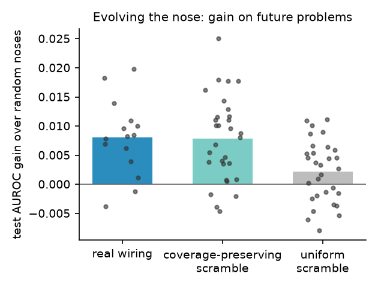
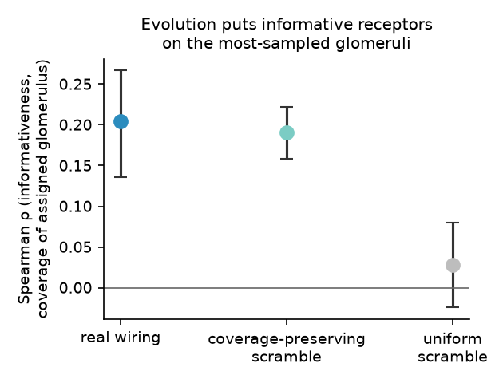
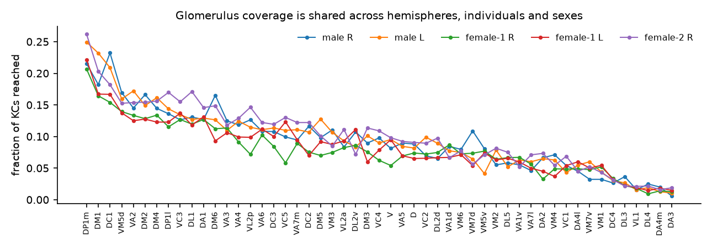

# LeetFly

A real fruit-fly **mushroom body**, wired from electron-microscopy connectomes, that learns to judge LeetCode
problems. Phase 1 is a working demo. Phase 2 asks a question the 2026 connectomes made answerable for the first
time: **which parts of a fly's brain wiring can evolution actually use?**

- Demo (3D site, private claude.ai link for now): https://claude.ai/artifact/4MYq4Ws4pdKm1zisyPK74h
- Local: `cd web && npm install && npm run dev`, or deploy it yourself (see [Deploy on Vercel](#deploy-on-vercel))

## The site

- **Brain** (`index.html`). The male's whole central nervous system as a point cloud (141,781 real neurons at
  their measured soma positions), with the 2,208-neuron learning circuit drawn from its real EM skeletons. Every
  spike travels along the actual arbours, and a raster and counters show them live. Modes:
  - **Smell**: any problem, including one you paste.
  - **Watch it learn**: the naive fly learns all 1,658 training problems with the exact trial-by-trial dopamine
    rule, and its accuracy on the 415 future problems climbs from 11% (chance) to 40%.
  - **Evolve a nose** and **Nose transplant**: the Phase 2 results.
- **Fly** (`fly.html`). The anatomically real *flybody* fly (legs, wings, proboscis) in an arena of 14 "technique"
  feeders. A problem becomes an odour plume and the same mushroom body votes:
  - a confident fly surges straight to its choice, and an unsure one casts (zig-zags) between its top two;
  - on the right feeder it drinks sugar (PAM dopamine), on a wrong one it gets a shock (PPL1) and tries again;
  - every visit updates its synapses.

## The fly

```
problem text ──TF-IDF──▶ 51 "receptors" (NMF topics, unsupervised)          ◀─ the nose (what evolution changes)
            ──nose──▶ 51 glomeruli ──divisive normalization──▶ uniglomerular PNs
            ──measured PN→KC synapses (MaleCNS / FlyWire / hemibrain)──▶ ~1,900 Kenyon cells (homeostatic)
            ──APL: only the top 2.5% fire──▶ KC→MBON synapses, depressed by dopamine (PAM reward / PPL1 punishment)
            ──▶ 14 technique approach/avoid output pairs
```

Only KC→MBON synapses learn, and only through dopamine. The rule (multiplicative depression of synapses from
active KCs) commutes, so it has an exact closed form (`src/leetfly/model/dopamine.py`, verified against the
trial-by-trial rule in `tests/`).

## Phase 1 results (MaleCNS right mushroom body, 415 future problems)

Test = the most recent 20% of technique-tagged problems (Jul 2023 → Mar 2025). All tuning used grouped 3-fold CV
on older problems (families like "Two Sum I–IV" never straddle folds).

| model | top guess correct | top-3 contains a correct | macro-AUROC |
|---|---|---|---|
| **fly, real wiring** | **0.398** [0.347, 0.443] | **0.680** | 0.779 |
| always guess the most frequent (B0) | 0.311 | 0.559 | 0.500 |
| logistic regression, same 51 channels (B1) | 0.390 | 0.692 | 0.791 |
| logistic regression, full TF-IDF (B2) | 0.460 | 0.769 | 0.821 |
| logistic regression on the fly's KC codes (B3) | 0.405 | 0.675 | 0.787 |
| degree-preserving rewiring ×20 | 0.397 ± 0.014 | | 0.776 ± 0.004 |
| uniform rewiring ×20 | 0.400 ± 0.013 | | 0.785 ± 0.003 |
| 20 random noses (real wiring) | 0.401 ± 0.014 | | 0.777 ± 0.007 |

Similar-problem search (mAP@10, relevant = shares a technique): FlyHash on real wiring 0.535, SimHash with the
same number of bits 0.493, degree-preserving nulls 0.516 ± 0.005, uniform nulls 0.529 ± 0.005, TF-IDF cosine 0.537.

Reading: the fly clearly beats guessing, ties a proper classifier given the same 51-channel input, and loses to a
classifier that reads every word. Its real wiring is **no better than scrambled wiring**, as ~20 other projects in
the Sept 2026 "fly brain" wave found for arbitrary tasks. (Pilot history, kept for honesty: `results/phase1_pilot_v1.json`
used worked examples in the text; dropping them, and extending the eta grid when the dev optimum hit its edge, were
decided on dev CV. The test set was scored three times in total.)

## Phase 2 — pre-registration (committed before any evolution run)

### Question

A fly's PN→KC wiring has an **inherited** part (glomerulus-level biases; some glomeruli reach ~15–35× more KCs, and
the same ones do in every fly we've looked at) and an **idiosyncratic** part (which exact KC gets which PN, random
per individual and even per hemisphere; Caron et al. 2013). Theory (Dorrell & Latham 2026) says learning is easier
when informative inputs sit on oversampled glomeruli or co-converging groups. Evolution can only act on the
inherited part. In real speciation it changes the **periphery**: *D. sechellia* retuned Or22a and doubled its
neurons for noni fruit (Auer et al. 2020). So: **evolve only the nose for a new niche (LeetCode), keep the real
wiring fixed, and transplant the evolved nose into other flies.** A nose that keeps working in another fly
exploited inherited wiring; one that breaks overfitted one fly's quirks.

### Design

- **Mushroom bodies (5 MBs, 3 flies, 2 sexes):** male MaleCNS v1.0 right and left; female FlyWire v783 right and
  left; female hemibrain v1.2 right. PN→KC ≥ 5 synapses; the same 51 olfactory glomeruli in all (hemibrain names
  aliased via FlyWire's `hemibrain_type`).
- **Nose (the genotype):** a permutation assigning the 51 receptor types to the 51 glomeruli, plus ORN counts
  (gain) per glomerulus with a fixed budget (mean 1) and bounds [0.25, 4].
- **Fixed:** the featurizer, antennal-lobe normalization, homeostasis, APL sparsity and the dopamine rule, all
  frozen at the Phase-1 settings (σ = 1, m = 0.05, sparsity 2.5%, η = 64, balanced).
- **Fitness:** mean dev-fold macro-AUROC (3 grouped folds) with the closed-form dopamine readout. Test is never used
  in evolution.
- **Evolution:** (μ + λ) ES, μ = 8, λ = 24, 150 generations, σ0 = 0.3 on log-gain, 1–3 receptor swaps with p = 0.8,
  1/5 success rule (`configs/evolve.yaml`). 3 seeds per condition.
- **Wirings per MB:** real; degree-preserving rewiring (**dp**, keeps each glomerulus's KC coverage and each KC's
  input count) × 2 samples; uniform rewiring (**uni**, each KC keeps its input count and synapse weights, but its
  glomeruli are drawn uniformly, destroying coverage bias) × 2 samples.
- **Primary metric:** test macro-AUROC (secondary: top-1 hit).
- **Born-nose baseline:** B(t, w) = mean over random noses (random permutation, gain 1): 200 per real MB, 100 per
  null sample.

### Quantities

- Evolvability: E(t, w) = test AUROC of a nose evolved on wiring w of MB t, minus B(t, w). Averaged over seeds (and
  null samples).
- Self gain: Gain_self(t) = E(t, real).
- Transplant: Gain(s→t) = test AUROC when target t (real wiring, its own dopamine learning and homeostasis) uses
  the nose evolved on source s's real wiring, minus B(t, real). Transfer ratio TR(s→t) = Gain(s→t) / Gain_self(t).
- Decomposition for target t:
  - periphery-only gain P(s→t): the gain from a nose evolved on s's *uniform* null, transplanted into t;
  - inherited-wiring gain = Gain(s→t) − P(s→t);
  - idiosyncratic gain = Gain_self(t) − Gain(s→t).
- Pair types:
  - within-fly (MaleCNS L↔R, FlyWire L↔R);
  - same sex, different fly (FlyWire ↔ hemibrain);
  - different sex (MaleCNS ↔ FlyWire, MaleCNS ↔ hemibrain).

### Predictions and decision rules

- **H1** (evolution helps): Gain_self(t) > 0 for all 5 MBs, with every seed > 0.
- **H2** (evolvability comes from coverage bias):
  - (a) mean over MB × seed units of E(real) − E(uni) > 0, with its bootstrap 95% CI excluding 0;
  - (b) |E(real) − E(dp)| < ½ · (E(real) − E(uni)).
- **H3** (Dorrell–Latham mechanism): for noses evolved on real and dp wirings, the Spearman ρ between a receptor's
  informativeness and its assigned glomerulus's KC coverage is > 0 (mean over runs, 95% CI excluding 0).
  Informativeness = mean over techniques of |AUROC − 0.5| of that receptor's activity on dev. For uni runs, ρ ≈ 0
  (CI including 0).
- **H4** (the useful structure is inherited): median TR over all ordered pairs s ≠ t ≥ 0.7, and the median TR
  within each pair type ≥ 0.7.
- **H5** (exploratory, sex): median TR across sexes < median TR female↔female. Report dimorphic pheromone
  glomeruli (DA1, VA1v, VL2a) coverage in both sexes.
- **H6** (exploratory, higher-order structure): E(real) − E(dp) > 0 with CI excluding 0. If it holds, check whether
  that extra gain transfers.

All outcomes will be reported whether or not they support the predictions.

## Phase 2 — results

75 evolution runs (5 MBs × {real, 2 degree-preserving, 2 uniform} × 3 seeds). 45 ran on a laptop (i5-12500H);
the 30 FlyWire runs ran on one AWS EC2 `c7a.2xlarge`, which is identical code and settings with the host recorded in
each result file. Analysis: `python -m leetfly.experiments.transplant` → `results/phase2.json`,
`results/phase2_report.txt`; figures in `results/figures/`.

### Pre-registered outcomes

| | prediction | outcome |
|---|---|---|
| **H1** | evolved noses beat random noses on future problems, in all 5 MBs and every seed | **not supported.** 13/15 real-wiring runs gain, and 4/5 MBs gain on every seed. The male right MB's seeds: −0.0013, −0.0038, +0.0040. Mean gain **+0.0080** test AUROC (small). |
| **H2** | evolvability comes from coverage bias | **supported.** E(real) = +0.0080, E(degree-preserving) = +0.0079, E(uniform) = +0.0022. real − uniform = +0.0058, 95% CI [0.0026, 0.0090]; \|real − dp\| = 0.0002. |
| **H3** | evolution puts informative receptors on high-coverage glomeruli | **supported.** Spearman ρ: real +0.204 [0.135, 0.267]; dp +0.191 [0.158, 0.222]; uniform +0.028 [−0.024, 0.080]. |
| **H4** | transfer ratio ≥ 0.7 overall and in every pair type | **not supported.** The median is undefined, because the male right MB's self gain was ≤ 0; female↔female median = 0.68. |
| H5 (expl.) | cross-sex transfer < same-sex | **not supported.** Mean transplant gain: cross-sex +0.0066, same-sex +0.0062, within-fly +0.0058. |
| H6 (expl.) | real wiring more evolvable than degree-preserving | **not supported.** +0.0002 [−0.0032, 0.0038]. |

Descriptive, from the same transplant matrix:
- On future problems a transplanted nose gives the target fly **+0.0064** on average against **+0.0080** for a fly's
  own evolved nose, a ratio of means of **0.79**; **18 of 20** transplants help.
- Noses evolved on the uniform null ("periphery-only") give ≤ 0 when transplanted into real wiring.

### Exploratory (not pre-registered): transplants scored on the problems the noses evolved for

Test-set gains mix two questions: whether a nose works in another fly's wiring, and whether dev-period gains survive
the drift to newer problems. Scoring every transplant on the dev folds removes the drift. Self gains are then
in-sample, so the idiosyncratic share is an upper bound.

| pair | nose evolved on real wiring | on degree-preserving null | on uniform null | median TR |
|---|---|---|---|---|
| self (in-sample) | +0.035 | +0.020 | +0.002 | 1 |
| other side, same fly | +0.020 | +0.020 | +0.002 | 0.58 |
| another female | +0.015 | +0.016 | +0.001 | 0.44 |
| other sex | +0.017 | +0.017 | +0.002 | 0.47 |


 

### Descriptive connectomics (5 MBs; `python -m leetfly.experiments.describe`)

- **Coverage is inherited.** The fraction of KCs each glomerulus reaches correlates at Spearman ρ = 0.86–0.96
  between every pair of MBs: within a fly, between females, and between the male and both females. The spread
  between the most- and least-sampled glomerulus is 15–36×. DP1m, DM1 and DC1 are always on top; DA3, DA4m, VL1 and
  DL4 are always at the bottom.
- **So is some higher-order structure, but evolution didn't use it.**
  - Co-convergence beyond coverage (glomerulus pairs sharing more KCs than a degree-preserving null predicts)
    correlates across MBs at r = 0.43–0.51, or 0.32–0.38 against a stricter null that rewires only within KC class
    (γ / α′β′ / αβ). Null graphs give r ≈ 0.
  - Yet noses evolved on real wiring gain no more than on degree-preserving nulls (H6). Inherited is not the same
    as useful for a new niche.
- **No sexual dimorphism in pheromone-glomerulus coverage.** The fraction of KCs reached by DA1, VA1v and VL2a is
  similar in the male (0.13 / 0.06 / 0.09) and the females (0.13–0.15 / 0.05–0.07 / 0.08–0.11).



### What it means

1. **With a random nose, the fly's wiring is just a prior.** Phase 1 found real ≈ scrambled. Once the nose can adapt,
   the **coverage bias becomes an asset**: brains whose glomeruli reach very different numbers of KCs (real, or
   degree-preserving scrambles) are ~3.6× more evolvable than brains with flattened coverage.
2. **Evolution rediscovers the theory.** Nobody told the evolution strategy about coverage, yet it puts the most
   informative receptors on the most-sampled glomeruli, as Dorrell & Latham's kernel theory says it should.
3. **What evolution uses is inherited, not individual.**
   - Noses evolved on degree-preserving scrambles (same coverage, random partners) transfer exactly as well as noses
     evolved on real wiring.
   - A nose evolved in one fly works in another, **including one of the other sex**, about as well as between two
     females.
   - Each fly's own partner choices add in-sample fitness that does not travel.
4. **Caveats.**
   - Effects on future problems are small (+0.008 AUROC), and one of the five MBs gained nothing.
   - Dev-period gains shrink under temporal drift.
   - LeetCode text is an arbitrary "niche".
   - The model is rate-based, with frozen hyperparameters.
   - Only three individual flies were used.
   - The pre-registered H1 and H4 criteria were not met.

## Data and licenses

- MaleCNS v1.0 (CC-BY 4.0), Berg et al., *Cell* 2026.
- FlyWire v783 (CC-BY 4.0 connectivity, Zenodo 10676866; annotations, Schlegel et al. 2024).
- Hemibrain v1.2 (Scheffer et al. 2020).
- LeetCodeDataset (Apache-2.0; problem text is used for training but never redistributed; the site ships only
  titles, slugs, tags and each problem's 51-number receptor vector).
- flybody fly model (Apache-2.0), Vaxenburg et al., *Nature* 2025 (Google DeepMind + HHMI Janelia), decimated
  for the web by `scripts/export_flybody.py`: bristles are rebuilt as cones; poses come from the model's joint
  springrefs.
- three.js (MIT).
- LeetCode is a trademark of LeetCode LLC; not affiliated.

## Reproduce

```
uv venv --python 3.11 .venv && uv pip install -e ".[dev]"
python -m leetfly.connectome.download                                      # MaleCNS + LeetCode
python -m leetfly.connectome.extract_mb --dataset malecns hemibrain flywire  # (FlyWire/hemibrain files: see paths.py)
python -m leetfly.experiments.phase1
python scripts/export_skeletons.py && python scripts/export_web_model.py
python scripts/export_brain_cloud.py && python scripts/export_learning.py  # whole-brain clouds, learn-mode data
python scripts/export_flybody.py && (cd web && npx @gltf-transform/cli meshopt public/fly/flybody.glb public/fly/flybody.glb)
python -m leetfly.experiments.evolve --jobs 14                             # Phase 2a
pytest && (cd web && npm test)
```

## Deploy on Vercel

The site is static: Vite builds `web/` into `web/dist`, with all data under `web/public/`.

1. On vercel.com, choose **Add New → Project** and import this GitHub repository.
2. Set **Root Directory** to `web`. `web/vercel.json` supplies the rest:
   - the Vite preset, `npm ci`, `npm run build` and the `dist` output;
   - clean URLs, so `/fly` works;
   - cache headers for the data.
3. Deploy. Every push to `main` redeploys.

Link previews use `web/public/og-brain.png` and `og-fly.png`. Vercel exposes the production domain at build time
(`VERCEL_PROJECT_PRODUCTION_URL`), and `vite.config.ts` turns the `og:image` / `og:url` tags into absolute URLs
with it. Other static hosts (GitHub Pages, Netlify) work with the same `dist` folder; there, previews fall back to
relative URLs.
